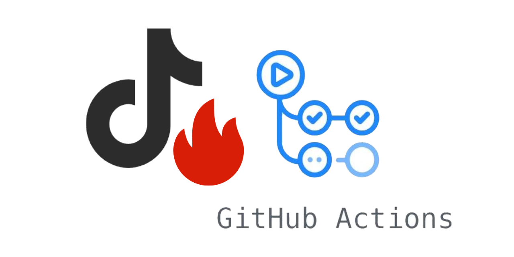

# DouYin Spark Flow




**抖音火花自动续火脚本** —— 自动给你的抖音好友和群聊发送消息，保持火花不断。

## 特性

- [x] 私信续火花（支持昵称/抖音号匹配）
- [x] 群聊续火花（支持群名称匹配）
- [x] 在线可视化配置器
- [x] 多账号、多目标批量支持
- [x] 一言 API 丰富消息内容
- [x] GitHub Actions 定时自动运行
- [x] 源码部署（本地/服务器/青龙面板）

基于 Playwright + Chrome 自动化操作[抖音创作者中心](https://creator.douyin.com/)。

## 快速开始

### 1. 获取配置

打开 [配置生成器](https://bthawake.github.io/DouYinspark-ALL/) 或本地打开 `docs/index.html`，填写：

- 消息模板、一言类型等基础设置
- 账号 cookies（需手动从浏览器导出，[教程](docs/配置生成器使用.md)）
- 目标好友（私信对象）
- 目标群聊（群聊对象）

点击 **一键复制 CONFIG**，得到 JSON 配置。

### 2. 部署

**GitHub Actions（推荐）：**

Fork 仓库 → Settings → Secrets and Variables → Actions → 新建 Secret，名称为 `CONFIG`，粘贴 JSON → 手动触发 workflow 或等每天自动运行。

**本地运行：**

```bash
pip install -r requirements.txt
playwright install chromium
```

在项目目录创建 `config.json`，粘贴 CONFIG 内容，然后：

```bash
python main.py
```

## 配置结构

```json
{
  "messageTemplate": "[API]",
  "matchMode": "short_id",
  "groupMatchMode": "name",
  "accounts": [{
    "username": "我的账号",
    "unique_id": "1234567890",
    "cookies": ["..."],
    "targets": ["12345678901"],
    "groups": ["群名称"]
  }]
}
```

- `matchMode`: `nickname`（昵称）或 `short_id`（抖音号）
- `groupMatchMode`: `name`（群名称）或 `id`（群ID）
- `targets`: 好友列表，匹配模式决定填什么
- `groups`: 群聊列表，匹配模式决定填什么

## 免责声明

1. 本项目为开源学习用途，仅用于技术研究和个人自用，严禁商业用途。
2. 使用本脚本产生的一切风险（包括账号限流、封禁等）由使用者自行承担。
3. 请合理控制运行频率，避免给抖音服务器造成压力。

## 开源协议

MIT License，详见 [LICENSE](LICENSE)。
