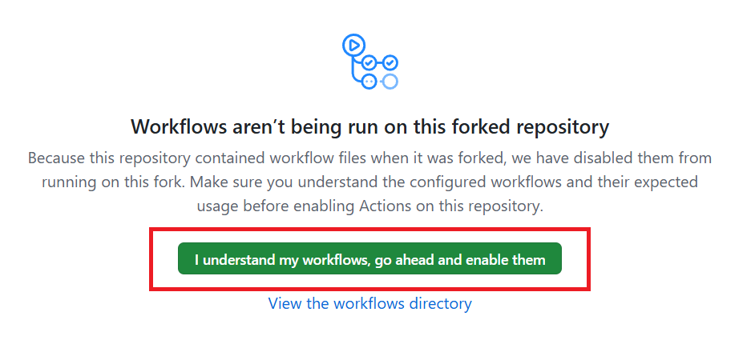
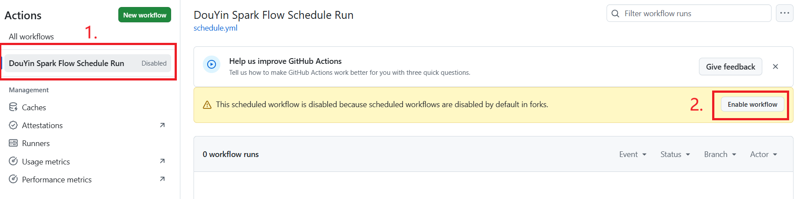

# Github Action 部署

> 前提：已通过[配置生成器](配置生成器使用.md)获取到完整的 CONFIG JSON。

本项目已预设 Action 配置，只需填写配置即可启用。

## 1. Fork 仓库

点击项目主页右上角 Fork，将仓库复制到你的 GitHub 账号下。

## 2. 启用 workflow

Fork 后在仓库上方点击 `Actions`，按图示启用工作流。





## 3. 创建 Environment

创建名为 `user-data` 的 Environment：

`Settings` → `Environments` → `New environment`，名称填 `user-data`。

## 4. 配置 CONFIG Secret

在 `user-data` Environment 中添加单个 Secret：

1. 打开配置生成器，点 **一键复制 CONFIG**
2. 进入 `Settings` → `Environments` → `user-data` → `Environment secrets` → `Add secret`
3. Name 填 `CONFIG`，Value 粘贴刚才复制的 JSON
4. 保存

## 5. 修改执行时间（可选）

编辑 `.github/workflows/schedule.yml`：

```yaml
schedule:
  - cron: "0 1 * * *"  # 每天 UTC 1:00（北京时间 9:00）
```

> GitHub Actions 使用 UTC 时区。北京时间 = UTC + 8。

常用示例：

- `0 1 * * *` — 每天北京时间 09:00
- `30 13 * * *` — 每天北京时间 21:30

## 6. 手动触发测试

仓库 Actions 页面 → `DouYin Spark Flow Schedule Run` → `Run workflow`。

建议首次部署后手动触发一次，验证配置正确。
